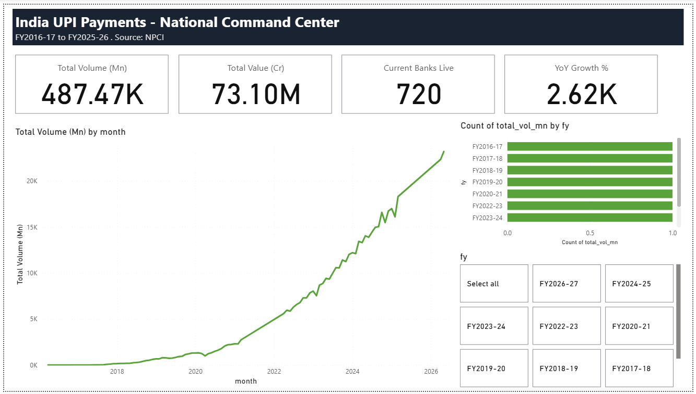
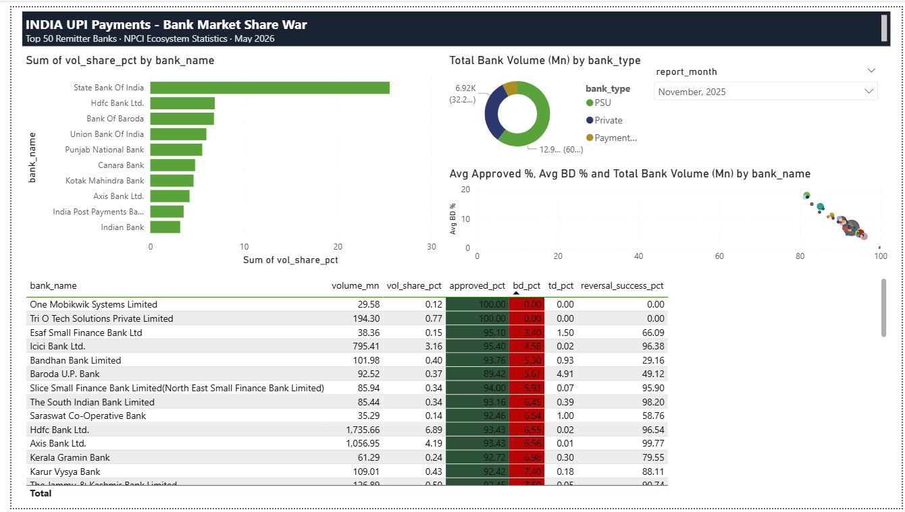
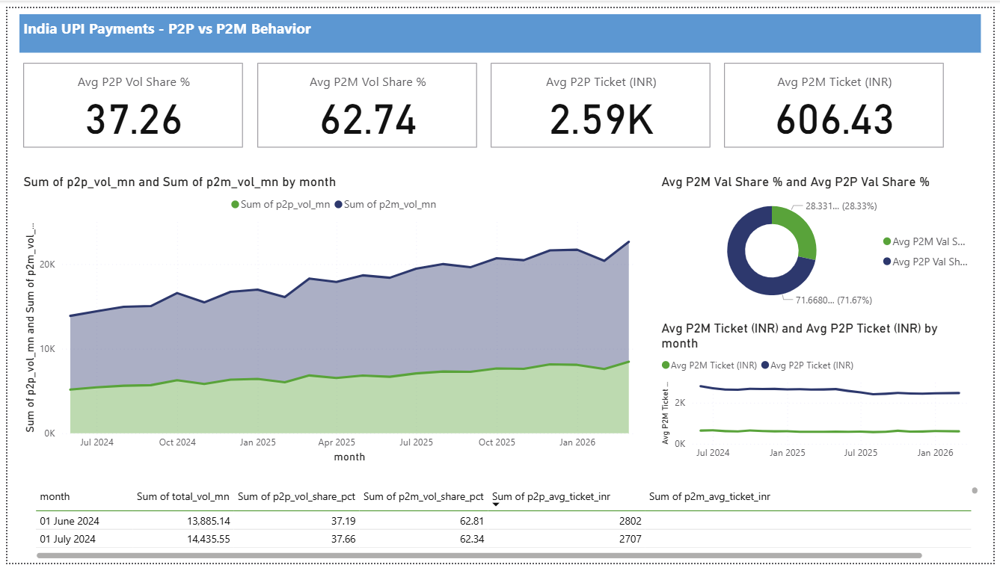
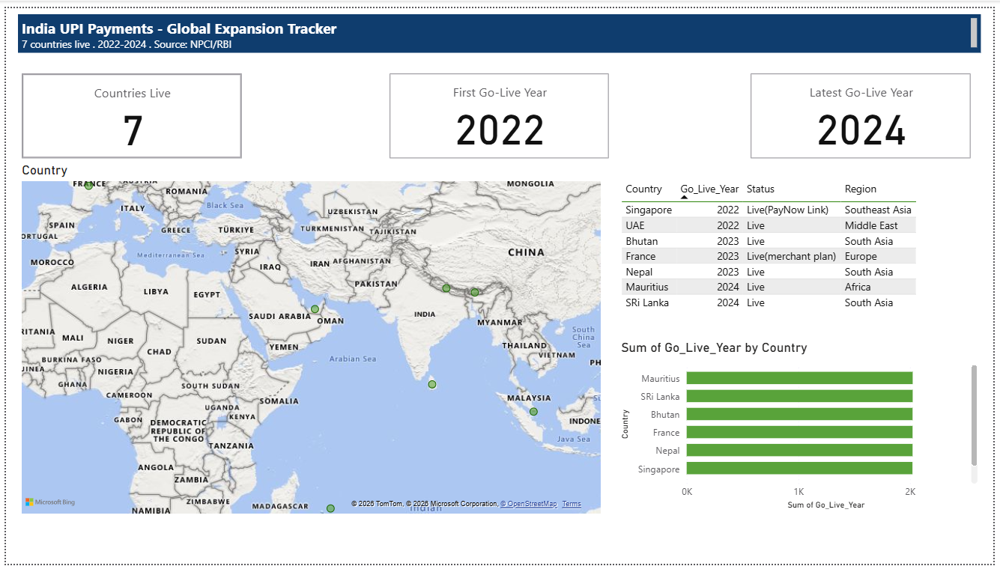

# UPI Digital Payments Analytics & BI Dashboard

An end-to-end analytics project on India's UPI (Unified Payments Interface) ecosystem — from raw NPCI/RBI statistics to a 4-page interactive Power BI dashboard covering national growth, bank-wise market share, P2P vs P2M transaction behavior, and UPI's global expansion.

## Overview

UPI processes tens of billions of transactions a month across 40+ banks in India. NPCI publishes this data publicly, but spread across multiple report formats with no single combined dataset. This project builds a Python ETL pipeline to pull that data together, stores it in SQLite, and presents it through a Power BI dashboard.

## Project structure

```
upi_project/
├── data/                     Raw and cleaned data files
├── powerbi_data/             CSV exports feeding the Power BI model
├── p2p_p2m_raw/              Monthly NPCI P2P/P2M source files
├── extract.py                Pulls and parses NPCI source data
├── transform.py               Cleans and reshapes extracted data
├── load.py                    Loads cleaned data into SQLite
├── load_to_sqlite.py          SQLite schema and load logic
├── config.py                  Project configuration
├── download_auto.py           Automated source file handling
├── export_to_powerbi.py       Exports SQLite tables to CSV for Power BI
├── main.py                     Pipeline entry point
├── schema.sql                  Database schema definition
├── requirements.txt
└── upi_data.db                SQLite database
```

## Pipeline

**1. Extract** — `extract.py` reads NPCI's monthly statistics (national volume/value, bank-wise performance, P2P/P2M split) from downloaded Excel/PDF source files.

**2. Transform** — `transform.py` cleans the extracted data: normalizes bank names, parses Indian-formatted numbers, derives fiscal-year and month fields.

**3. Load to SQLite** — `load_to_sqlite.py` writes the cleaned data into `upi_data.db` using the schema in `schema.sql`. Tables: monthly national stats, bank-level performance, and derived summary views.

**4. Export to Power BI** — `export_to_powerbi.py` exports the SQLite tables to CSV files in `powerbi_data/`, which Power BI imports directly.

**5. Model and visualize** — Power BI imports the CSVs, builds relationships between tables, and computes additional measures in DAX (YoY growth, average ticket size, top-N bank share) on top of the SQLite data.

## Data sources

- NPCI UPI Product Statistics (monthly national figures)
- NPCI UPI Ecosystem Statistics (bank-wise performance, P2P/P2M split)
- Manually compiled UPI international go-live dates

## Dashboard pages

**Page 1 — National Command Center**
Total transaction volume/value over time, active banks, year-over-year growth, fiscal-year breakdown.


**Page 2 — Bank Market Share War**
Top 10 banks by volume, PSU/Private/Payment Bank split, approval rate vs business decline rate by bank.


**Page 3 — P2P vs P2M Behavior**
Person-to-person vs person-to-merchant split over time, average ticket size comparison.


**Page 4 — Global Expansion Tracker**
Countries where UPI is live internationally, go-live timeline, adoption status.


## Tech stack

Python (pandas, openpyxl) · SQLite · Power Query · Power BI · DAX

## Running this yourself

1. Clone the repo
2. Run `python main.py` to extract, transform, and load NPCI data into SQLite
3. Run `python export_to_powerbi.py` to generate the CSVs in `powerbi_data/`
4. Open the `.pbix` file in Power BI Desktop and refresh

## Author

Prabhav Khare — [GitHub](https://github.com/Prabhav54)
